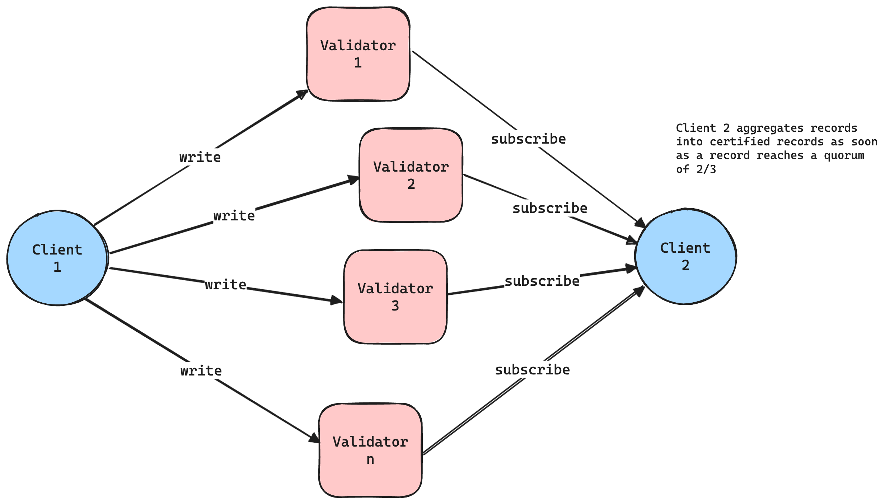

# `DATO`

_Decentralized Approximate Timekeeping Oracle_

## Introduction

Many problems in blockchains right now can be helped by having a lightweight protocol that can _agree on which messages were seen, and when they were seen_. Note that this does not require _total ordering_, meaning there is no need for full BFT SMR protocols like Tendermint or Hotstuff, which often implies having a single leader, limited throughput, and added latency.

Instead, reaching rough consensus on time can be achieved by sending a message $M$ to some validators / replicas $R$, getting each of their individual timestamps until a quorum of 2/3 is reached, and then calculating the _median_ of all the timestamps to achieve the _certified timestamp_.
Each validator will sign over the message and the timestamp with their BLS private key, and clients can then aggregate these signatures into 1 quorum certificate. This certificate can then be verified by anyone / any chain (assuming PKI).

DATO exhibits the following properties:

- Linear communication complexity: $n \times (m + r)$ ($m$ = message size, $r$ = response size)
- Minimal, constant latency
- Maximal throughput

## Use Cases

We'll look at 3 use cases:

- Fair exchange accountability
- Censorship-resistant message feeds
- Simultaneous release in BRAID

### Fair Exchange accountability

Suppose Alice wants to trade an item with Bob over the internet in an atomic manner, meaning that both parties receive the item, or none do.
This is known as the fair exchange problem, and it is generally unsolvable without a trusted third party (TTP).

PBS is an example of this, where the relay (TTP) mediates the fair exchange by only delivering the payload to the proposer if the proposer has committed to the associated header. Decentralizing PBS could involve replacing the relay with a committee that, among other things, votes on the timeliness of the payload reveal (the [PTC design](https://ethresear.ch/t/payload-timeliness-committee-ptc-an-epbs-design/16054)).

Other duties like checking block validity and the block value could be done inside of a TEE like in [TEE-Boost](https://collective.flashbots.net/t/tee-boost/3741), but making sure the builder reveals the payload when a proposer has committed to it needs to be solved in another way (host machine can always censor incoming and outgoing TEE traffic).

With DATO, we can optimistically replace the relay by acting as a "record of communication" between the builder and the proposer. In case of a fault, anyone can replay the certified log of records to use as evidence.

**Flow**

- Happy case

1. (Staked) builders make bids to a proposer (direct communication)
2. Proposer selects a winning bid and broadcasts the commitment on DATO and directly to the builder
3. DATO timestamps the commitment ($T_{commit}$)
4. Builder reveals the payload by broadcasting it on DATO (and on the Ethereum P2P network)
5. Signed block is proposed

- Faulty case

1. (Staked) builders make bids to a proposer (direct communication)
2. Proposer selects a winning bid and broadcasts the commitment on DATO and directly to the builder
3. DATO timestamps the commitment ($T_{commit}$)
4. Builder does NOT reveal the payload
5. Proposer misses the block, but can request a certificate of UNAVAILABILITY for the timestamp at $T_{commit} + \Delta$
6. Proposer uses the certficiate of UNAVAILABILITY to slash the builder

Fair exchange problems also show up in various proposer commitment & preconf protocols like [Bolt](https://chainbound.github.io/bolt-docs), which is where we initially got the idea.

### Censorship-resistant message feeds

In the case of single-sequencer protocols like current rollups, or TEE-run auctions, it is currently not possible to attribute censorship faults. Having a verifiable record of messages fixes that issue, and can reliably detect even very short-term censorship.

Sequencers could commit to reading their inputs from DATO (as an additional channel next to direct RPC). Any message sent on DATO would need to be included within some delta set by the protocol. If these messages are not included within that delta, users can use the certificate to attribute a censorship fault. For mempool privacy, transactions on this layer can be encrypted with the sequencer public key.

TEEs could also commit to reading their bids from DATO, which (in the case of verifiable auction rules) could allow anyone to verify the outcome of an auction. This could detect the censorship of bids.

### BRAID simultaneous release & last-look

BRAID (an implementation of MCP), has an incentive problem when various proposers for a round are supposed to release their partial block. This is because other proposers could benefit from looking the contents of other proposers' blocks in the case they contain profitable transactions. They can then steal these transactions and put them in their own partial blocks.

A potential solution could look like this:

1. Proposers threshold encrypt their partial blocks and broadcast it on DATO along with a "delay" request
2. DATO validators timestamp the request, but only reveal it after the delay (timelock)
3. Clients can collect the quorum certificate after the delay and decrypt the payload

The only way for proposers to steal the payloads from other proposers is for them to wait until the timelock is completed and collect the quorum certificate. Only then will they be able to broadcast their partial blocks, which would be too late and detectable.

NOTE: this would require some added functionality to DATO for the time locking functionality.

## Running the demo

Requirements:

- [Docker engine](https://www.docker.com/)
- [Rust toolchain](https://www.rust-lang.org/tools/install)
- [Just](https://github.com/casey/just)

You can run DATO yourself with the [`launch.sh`](./launch.sh) script.

1. Build the client and validator images:

```bash
./launch.sh -b
```

1. Run the test setup with a registry file, for example with 200 validators:

```bash
./launch.sh -r registry-20.txt
```

This will run 20 validators, and 1 client. The client will connect to all validators. Simulated latency will be added
to the links between the clients and the validators (between 0 and 400 by default, tune this limit with the `-l` flag)

You can then run the demo example with:

```bash
cargo run --example cr_feed
```

The demo is setup like this:



## Further Work

- Analyzing the security properties (tolerated threshold adversary, network models)
- Performance analysis & testing
- DATO for threshold encryption
- Handling of fees for validators

## References & Prior Work

- https://arxiv.org/abs/2003.11506
- https://collective.flashbots.net/t/current-thinking-for-consensus/2695
- https://www.commonprefix.com/static/clients/flashbots/flashbots_report.pdf
- https://ethresear.ch/t/payload-timeliness-committee-ptc-an-epbs-design/16054
